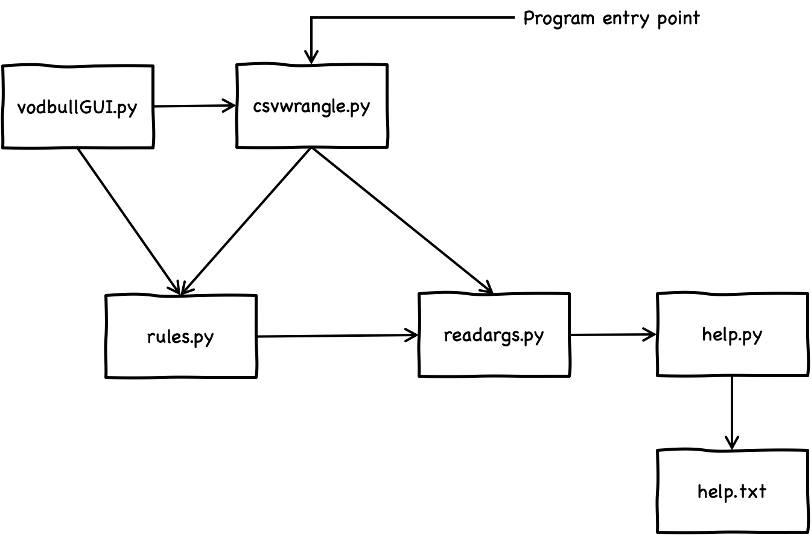
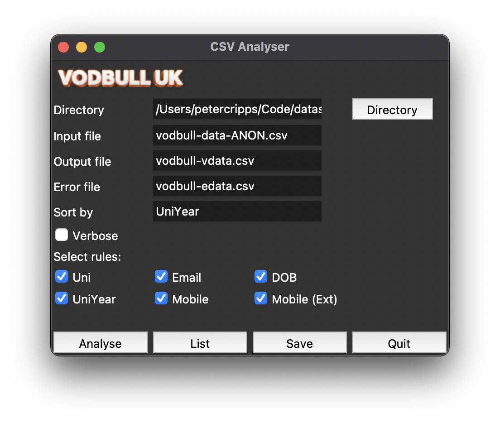

# csv-data-wrangling
## Overview

Analyses data in a CSV according to some rules.

The following Python files are used: 
- `appwindow.py` UI for CSV Analyser- 
- `csvanalyse.py` is the entry point for the program.
- `readargs.py` reads command line arguments prior to executing analyse function.
- `rules.py` are the rules that check the fields in the CSV file.
- `help.py` runs the help function.
- `config.py` contains globals for application

The following data/config files are used:
- `config.yaml` config parameters
- `help.txt` help text.

Here's a component model showing the relationships (dependencies) between these files.

## Installation and Configuration

Download or clone the repo.

The YAML file `config.yaml` contains all the parameters which can be modified.

To run the programme enter one of the following in a terminal window:

`python3 csvanalyser.py` (command line version)

or 

`python3 appwindow.py` which will open this UI:

Fields in the UI are as follows:

- `Directory` Path where the CSV files are found.
- `Input file` Name of the input CSV file.
- `Output file` Name of the CSV output file.
- `Error file` Name of a separate CSV where all those lines in error are captured. If no file is entered here all error lines will be written to the output files with fields in error identified in a new column called 'Error'.
- `Sort by` The field to sort output by. This must be ONE of the column names identified in the YAML file (see below).
- `Verbose` If this is checked more output is provided in the terminal during analysis.
- `Select rules` Check the box next to the rules you want to run.

Buttons are as follows:
- `Analyse` Analyse the CSV and output to the output/error file.
- `List` List the CSV to the terminal.
- `Save` Save the changes made in the UI to the YAML file without analysing. Note that a save is also done prior to analysing the CSV.
- `Quit` Quit the application.

If the input file contains columns which are in a different order then the order of the column names in the YAML file must be changed accordingly. This list is used to map to the columns used internally by the analyser and also to sort on. These names (one of which can be used to sort on) are:
- Lname
- Fname
- Email
- OptOut
- TicketType
- OrderDate
- OrderRef
- RepName
- RepEmail
- Uni
- Mobile
- DOB
- UniYear

One or more rules can be prevented from running by setting the flag for that rule in the YAML file to 'False' (or unchecking the checkbox in the UI).
The rules currently available are:
- `Email` Checks the email is well-formed.
- `Uni` Checks the university name is in the list of valid universities in this YAML.
- `Mobile` Checks the phone number is a valid GB number using basic checks.
- `MobileExt` Checks the phone number is a valid GB number using extended checks.
- `DOB` Checks the date of birth makes applicant at least 18,
- `UniYear` Checks the university year is in the list of valid universitie years in this YAML.